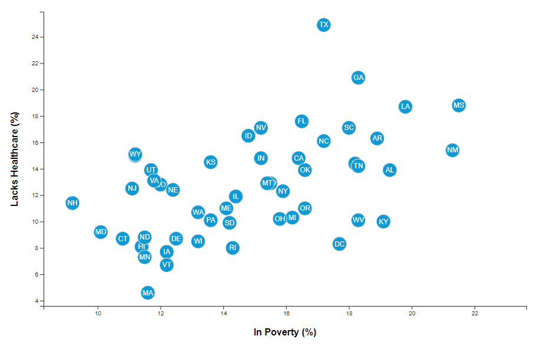

# D3 Visualization

## U.S. Demographics and Health Risks

The Dashboard can be viewed here.

### Objective

The purpose of this project was to compare demographic and health data by states using data from the [US Census](https://data.census.gov/cedsci/) and [CDC Behavioral Risk Factor](https://chronicdata.cdc.gov/). The included data set is based on 2014 ACS 1-year estimates. The current data set includes data on rates of income, obesity, poverty, etc. by state. 

#### The Scripts

You will need to use **http-server** to run the scripts because the data is from an outside source.

**<u>Interactive Visualization</u>** - The script `app.js` is already included in the index.html. It creates dynamic graphics with D3 that will let us interact with our data. There are three demographics and three risk factors in the scatter plot, and using click events we can decide which data to display.

We also implemented tooltips in our D3 graphics to reveal a specific element's data when we hover the cursor over the element. 

Use the link above to view visualization. 

**<u>Simple Scatter Plot</u>** - The script `apps11.js`  creates a simple scatter plot between two of the data variables, such as Healthcare vs. Poverty.

To create the simple plot, you will need to replace `app.js` with `app11.js` in *index.html* file

 

###  Tools / Techniques Used:

- JavaScript

- HTML/CSS

  

### About Data

 The dataset `assets/data/data.csv` is based on 2014 ACS 1-year estimates from [US Census](https://data.census.gov/cedsci/). Columns in bold are used in our visualization. MOE stands for "margin of error."

### Before You Begin

- **Number of records:**     51
- **Columns** (18):
  - id
  - **state**
  - **abbr**
  - **poverty**
  - povertyMoe
  - **age**
  - ageMoe
  - **income**
  - incomeMoe
  - **healthcare**
  - healthcareLow
  - healthcareHigh
  - **obesity**
  - obesityLow
  - obesityHigh
  - **smokes**
  - smokesLow
  - smokesHigh